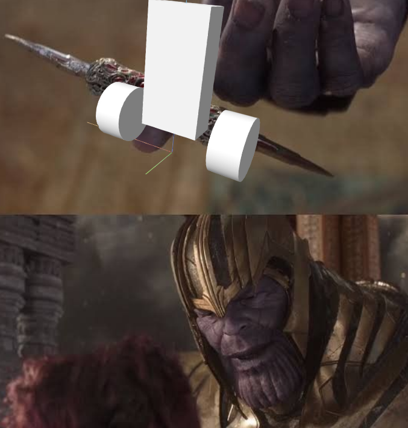

# perfectlybalanced

It is not perfectly balanced yet. But at least I reuse memes from 2018.

Currently has a working PID and not working cascaded PID with positon control. 

## What it has
PID to balance it.

## What I am working on and why I have not done it
Cascaded PID to do position control. Pybullet seems to be very unstable and causes the robot to fly and flip randomly. If anyone knows what's up please let me know.

